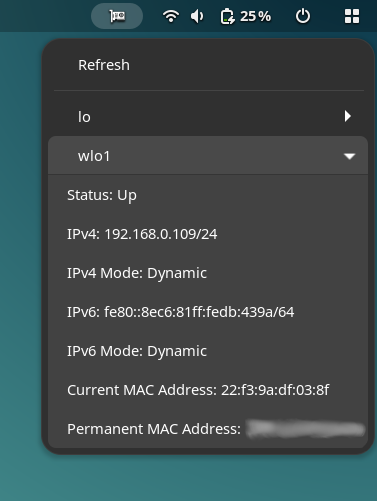

# Network Interfaces Info
Display Network Interfaces Information on GNOME Top Bar.

## About
With this extension, you can effortlessly view information about your network interfaces.

## Refresh button
Click this button to update the information displayed for each interface.